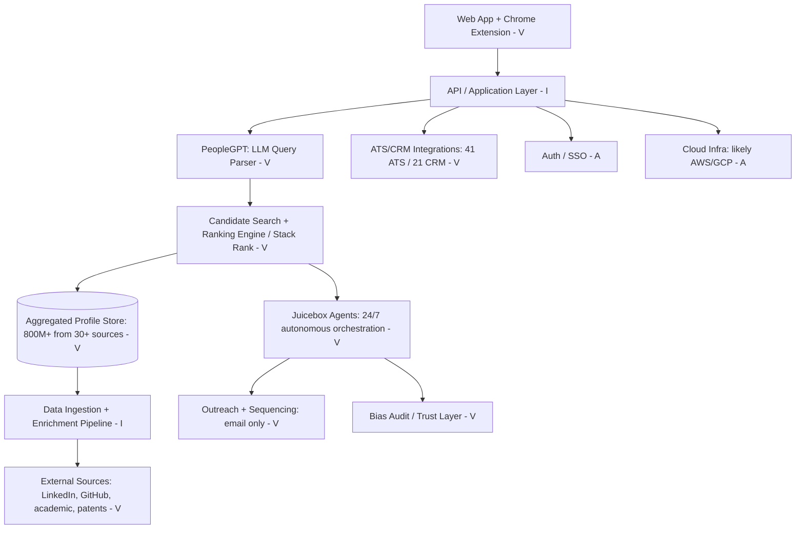
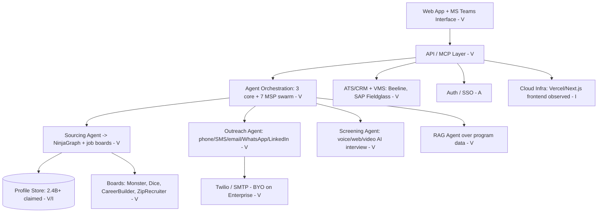
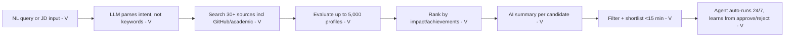

# Competitive War-Game Analysis: NinjaHire vs Juicebox AI (v2)

*Prepared for the founder of NinjaHire (bootstrapped, pre-revenue). Current as of August 25, 2026. Paste-ready for Notion; Mermaid diagrams are in fenced code blocks.*

---

## 1. Research Summary

**Bottom line up front:** NinjaHire should NOT fight Juicebox head-to-head in AI candidate sourcing. The highest-expected-value path is to flank into **MSP / VMS-integrated contingent-workforce recruiting**, a segment Juicebox does not serve, where NinjaHire's 7-agent "Agentic Swarm," multichannel voice screening, and the founder's prior contingent-workforce exit (WillHire, acquired by PRO Unlimited/Magnit) give it a credible, defensible wedge. Head-to-head is a losing fight against a company that has raised $116M and serves thousands of customers.

### Sources found per company

| # | Source | URL | What it contributed |
|---|--------|-----|---------------------|
| 1 | NinjaHire homepage | ninjahire.co | 3-agent architecture, 2.4B+ profiles claim, NinjaGraph, testimonials, SOC 2/GDPR badges [V] |
| 2 | NinjaHire MSP Agent page | ninjahire.co/mspagent | 7-agent "Agentic Swarm," VMS/MSP positioning, white-label, usage-based pricing [V] |
| 3 | NinjaHire pricing page | ninjahire.co/pricing | Starter $170/mo, Professional $509/mo, Enterprise custom; credits model; VMS integrations [V] |
| 4 | NinjaHire vs ConverzAI / vs hireEZ pages | ninjahire.co/compare | Native Beeline/SAP Fieldglass VMS integrations, phone agents, self-stated differentiators [V] |
| 5 | Juicebox homepage + llms.txt | juicebox.ai, juicebox.ai/llms.txt | 800M+ profiles, PeopleGPT, Agents, pricing, 41 ATS/21 CRM, ICP, case studies, traction [V] |
| 6 | Juicebox Series B (Business Wire, Axios) | businesswire.com, axios.com | $80M Series B at $850M valuation, DST Global, 5,000 customers, 3x ARR [V] |
| 7 | Sacra / Tracxn / Startup Intros | sacra.com, tracxn.com | $116M total over 3 rounds/8 investors; founders; ~35 team size [V/Disputed] |
| 8 | Juicebox reviews (G2, MindHunt, Leonar, HeroHunt, Daily Hire) | multiple | Verified weaknesses: data freshness, email bounces, email-only, English-only, "same candidate" problem [V] |
| 9 | ConverzAI funding (VentureBeat, PR Newswire) | venturebeat.com | $16M Series A (Menlo Ventures), the direct staffing-AI flanker to benchmark against [V] |
| 10 | Founder background (WillHire/PRO Unlimited, PlugScale, SIG) | prweb.com, plugscale.com, sig.org | Praneeth Patlola's contingent-workforce/direct-sourcing exit; PlugScale sister-company ties [V] |
| 11 | Crunchbase / RocketReach / ZoomInfo (NinjaHire) | crunchbase.com, rocketreach.co | ~8-10 employees, "Pre-Seed" label (no disclosed amount), Texas incorporation 09/12/2025 [V/I] |
| 12 | Contingent-workforce market data (Astute, SIA, Conexis) | globenewswire.com, staffingindustry.com | Market size, 79% VMS adoption at large firms, AI-orchestration thesis [V] |

### Research gaps and how they limit this analysis
- **No third-party NinjaHire product reviews exist.** G2 and Capterra both show zero reviews. Product quality is UNVERIFIABLE; all capability claims are from NinjaHire's own marketing [V for claim, I for reality].
- **NinjaHire funding is opaque.** Crunchbase shows a "Pre-Seed round" but every dollar amount, date, and investor is paywall-obfuscated. No press release exists. This is consistent with effectively bootstrapped/founder-funded status [I].
- **NinjaHire traction claims contradict founder input.** The site says "500+ recruiters use this workflow daily" and "hundreds of staffing firms," but the founder states pre-revenue, zero customers. Treat all site traction numbers as aspirational marketing, not evidence [Disputed].
- **Juicebox's own customer count is internally inconsistent** (5,000 in the March 2026 Series B release vs 6,000+ in its August 2026 llms.txt). Marked [Disputed] throughout.
- **LinkedIn was not directly accessible** (robots-blocked); NinjaHire team data is triangulated from ZoomInfo, RocketReach, Crunchbase, and public LinkedIn post snippets.

**Source count: 12+ unique sources across both companies. All 7 required research categories returned data for Juicebox; for NinjaHire, the "product reviews" and "funding data" categories returned only gaps (noted above).**

---

## 2. Solutions Comparison (Deliverable 1)

| Dimension | Juicebox AI | NinjaHire | Advantage |
|-----------|-------------|-----------|-----------|
| One-line description | AI-native outbound sourcing platform: describe a candidate in plain English, get a ranked shortlist [V-5] | AI recruiting platform with autonomous agents for staffing agencies + a 7-agent MSP program suite [V-1,2] | Tie (different jobs) |
| Core value proposition | "Up to 90% less time identifying top candidates" via PeopleGPT [V-5] | "Fill positions 10x faster"; end-to-end automation of sourcing, outreach, screening [V-1] | Juicebox (proven, cited) |
| Primary use case | Outbound sourcing of passive/hard-to-find talent for in-house tech TA teams [V-5] | High-volume, multi-client, speed-first staffing + contingent/MSP delivery [V-1,4] | NinjaHire (for staffing niche) |
| AI/ML capabilities | PeopleGPT LLM search + Stack Rank; evaluates up to 5,000 profiles, shortlist in <15 min vs 2-3 hrs manual [V-5]; conversational Agent 4.0 that pushes back on bad searches [V, blog] | 3 core agents (Sourcing/Outreach/Screening) + conversational voice/web screening with "Conversational Intelligence Metrics"; 7-agent MSP swarm [V-1,2] | Juicebox (verified benchmarks); NinjaHire broader on paper only |
| Candidate sourcing method | 800M+ profiles across 30+ sources incl. GitHub, academic papers, patents [V-5] | Claims 2.4B+ profiles via NinjaGraph + Monster, Dice, CareerBuilder, ZipRecruiter [V-1]; job-board-first (active seekers) [V-4] | NinjaHire (volume claim); Juicebox (verified quality, passive talent) |
| Database size | 800M+ profiles [V-5] | 2.4B+ profiles claimed [V-1, unverifiable, likely counts overlapping records] [I] | Juicebox (credible/verified) |
| ATS integrations | 41 ATS systems + 21 CRMs (Greenhouse, Lever, Ashby, Bullhorn) [V-5, enriched] | ATS/CRM integrations on Professional tier; Bullhorn/Crelate/JobDiva referenced [V-3,4] | Juicebox (breadth verified) |
| CRM / outreach features | Built-in CRM + multi-step email sequences, up to 3x more replies; **email-only** [V-5,8] | Multichannel: phone, SMS, email, WhatsApp, LinkedIn; branded SMS; parallel AI phone calls (up to 100) [V-1,3] | **NinjaHire (decisive: multichannel vs email-only)** |
| Screening / interviewing | Batch Evaluations (beta) ranks applicants; no voice/phone screening [V-5] | Conversational AI voice + web + video screening; async AI interviewer; live interview co-pilot [V-1,2] | **NinjaHire (voice screening is a real gap for Juicebox)** |
| Collaboration features | Team seats, shared searches, shortlists, hiring-manager seats on Business plan [V-5] | 5 users (Starter) to unlimited (Enterprise); MSP swarm coordinates HM + supplier + candidate [V-2,3] | NinjaHire (team pricing); Juicebox (mature product) |
| Pricing model | Per-seat SaaS + per-agent add-on [V-5] | Flat monthly with credit pools + users included; usage-based for MSP agents [V-3] | NinjaHire (flat pricing friendlier to agencies) |
| Starting price point | Free $0; Starter $139/seat/mo ($119 annual); Growth $199/seat/mo ($179 annual); Agents +$199/agent/mo [V-5, enriched] | Starter $170/mo (2,000 credits, 5 users, annual); Professional $509/mo (6,100 credits, 25 users) [V-3] | NinjaHire (more seats per dollar for teams) |
| Enterprise tier | Business: custom pricing, unlimited contacts, 41 ATS/21 CRM, priority support [V-5] | Enterprise: custom, 10,000+ credits, unlimited users, BYO Twilio/SMTP, 100 parallel calls [V-3] | Tie |
| Free tier / trial | Free tier + free trial, one full search, no credit card [V-5] | 30-day free trial, no credit card [V-1] | Juicebox (permanent free tier) |
| Platform (web/mobile/extension) | Web app + Chrome extension [V-5] | Web app + Microsoft Teams-native agent access; MCP + API [V-1,2] | NinjaHire (Teams + MCP is novel); Juicebox (extension proven) |
| Data privacy / compliance | SOC 2, trust center, independent monthly bias audits on ~30,000 profiles [V, SiliconANGLE] | AICPA SOC 2 badge + "GDPR Ready" claim; CCPA + AI Interview Notice pages [V-1] | Juicebox (audited bias testing is a differentiator) |
| Voice/phone outreach | None [V-5,8] | Up to 100 parallel AI phone calls; inbound + outbound voice agents [V-3,4] | **NinjaHire** |
| MSP / contingent-workforce support | None; positions as ATS-adjacent sourcing, not contingent/VMS [V-5] | Native Beeline + SAP Fieldglass VMS integrations; 7-agent MSP program suite; white-label [V-2,4] | **NinjaHire (uncontested)** |
| Agent architecture | Multiple parallel agents (one per role), conversational Agent 4.0, real-time learning [V, blog] | Multi-agent "swarm": Hiring Manager, VMS, Scheduling, AI Interview, Live Interview Co-Pilot, RAG, Supplier agents [V-2] | NinjaHire (breadth); Juicebox (depth + proven learning loop) |
| Traction / proof | 5,000-6,000 customers [Disputed-6,5]; $10M+ ARR tripled since Series A; Ramp, Notion, Perplexity, Cursor [V-6] | Zero paying customers (founder-stated); unattributed testimonials only [Disputed-1] | **Juicebox (overwhelming)** |
| **Overall positioning** | The category-leading, VC-funded AI sourcing engine for in-house tech recruiting teams that win by finding passive talent faster [V-5,6] | An unproven but architecturally broad, staffing/MSP-focused automation suite betting on multichannel + contingent-workforce depth where incumbents are absent [I-1,2,4] | — |

---

## 3. ICP Analysis (Deliverable 2)

### Juicebox AI (evidence-based)
- **Primary ICP job titles:** TA leads, heads of talent, hiring managers, technical recruiters [V-5].
- **Company size:** Series B+ startups and mid-market tech, 50-2,000 employees [V-5].
- **Industry vertical:** High-growth technology, AI labs, fintech [V-5,6].
- **Core pain point:** Inbound is broken (average job posting gets ~250 applications, many AI-generated/fake); teams must proactively source scarce passive talent [V-5].
- **Buying trigger:** A hard-to-fill technical req, a hiring surge with a lean team, or recruiter time lost to Boolean/manual sourcing (up to 13 hrs/week) [V-5].
- **Evidence:** Named customers (Ramp, Notion, Perplexity, Cursor, Cognition); case studies center on tech companies scaling teams (Binti hired 9 of 12 key roles; Starbridge scaled 20 to 60); pricing is per-seat and self-serve; PeopleGPT indexes GitHub/academic sources signaling technical roles [V-5,6].
- **Secondary ICP:** Boutique/mid-size recruiting agencies on thin margins wanting speed-to-shortlist; and founders hiring without a TA function (one built a 20-person team on the platform) [V-5].

### NinjaHire (design-intent only, NOT customer-validated)
**Critical caveat: NinjaHire is pre-revenue with zero customers. The following ICP is inferred entirely from site positioning and product design, not from customer evidence. It represents who NinjaHire is BUILT for, not who it has SOLD to.**
- **Primary intended ICP job titles:** Agency owners, staffing delivery managers, MSP program managers, RPO leads [I-1,2].
- **Company size:** Small-to-mid staffing agencies and enterprise contingent-workforce programs [I-2,4].
- **Industry vertical:** IT/light-industrial/healthcare contract staffing; MSP-governed contingent labor [I-2, blog].
- **Core pain point:** Speed-to-submit under MSP SLAs (must submit 3 qualified contractors within 24 hours), VMS bottlenecks, rate compression forcing more reqs per recruiter, and multichannel candidate engagement [V-2, blog].
- **Buying trigger:** Losing VMS submission races, recruiter burnout on high-volume desks, or an MSP mandate to modernize [I, blog].
- **Evidence:** Homepage headline "AI-Powered Recruiting Platform for Staffing Agencies"; a dedicated MSP page with VMS/supplier agents; native Beeline/SAP Fieldglass integrations; flat team pricing; the founder's WillHire/direct-sourcing lineage [V-1,2,4].
- **Secondary intended ICP:** High-volume corporate TA in healthcare/light-industrial needing voice screening at scale [I, blog].

### ICP Overlap Analysis (the strategic core)
- **Same pond (contested):** Boutique/mid-size recruiting agencies doing permanent placement. Both target this. Juicebox already serves it with a proven product, transparent pricing, and 5,000-6,000 logos. NinjaHire has zero proof here. **Avoid direct contest.**
- **Juicebox's uncontested territory:** In-house tech TA teams sourcing passive engineers/researchers. NinjaHire has no credible wedge here (data quality, brand, integrations all favor Juicebox). **Do not enter.**
- **NinjaHire's uncontested flank (underserved by both):** **MSP / VMS-integrated / staffing-supplier contingent-workforce recruiting.** Juicebox explicitly is not built for contingent/VMS workflows (no VMS integration, no voice screening, email-only). This is the segment where NinjaHire can win decisively, and it aligns with the founder's domain expertise. **This is the flanking opportunity.** [V-2,4,5; I]

---

## 4. Architecture Diagrams (Deliverable 3)

**Fallback notice applies to both:** Product websites expose almost no true architecture. Fewer than 3 components are Verified per company; the rest are inferred from product behavior, job postings, and category norms. Both diagrams below are titled hypothetical and must not be read as confirmed infrastructure.

### Juicebox — Hypothetical Architecture, Based on Product Behavior and Job Postings

**Confidence summary:** 7 verified, 3 inferred, 2 assumed.
**Key unknowns:** Cannot determine cloud provider, database engine, or model vendor (OpenAI vs Anthropic vs in-house) without job postings or engineering blog access.

### NinjaHire — Hypothetical Architecture, Based on Product Behavior and Job Postings

**Confidence summary:** 9 verified (as marketing claims), 2 inferred, 1 assumed. Note: "verified" means the capability is claimed on the site, not that it is proven to work at scale.
**Key unknowns:** Cannot verify the 2.4B profile store is real vs. an aggregate of overlapping licensed feeds; cannot confirm whether voice/screening agents are production-grade or demo-stage without a live trial or customer reference.

---

## 5. Workflows & User Flows (Deliverable 4)

### Juicebox — Recruiter Workflow

### Juicebox — Candidate Sourcing Flow (the AI differentiator)

**Divergence note (Juicebox):** Juicebox's flow is optimized for one job: turning a plain-English description of a person into a high-quality shortlist of passive candidates, fast, then handing off to email. Its entire product depth is top-of-funnel. Everything after "positive reply" (screening, scheduling, interviewing, placement, VMS submission) is outside its scope. That boundary is exactly where NinjaHire's flow begins to diverge.

### NinjaHire — Recruiter Workflow

### NinjaHire — MSP Sourcing/Delivery Flow (the true differentiator)

```mermaid
flowchart LR
    A[Requisition released in VMS - V] --> B[VMS Agent ingests req - V]
    B --> C[Hiring Manager Agent extracts intent via chat/voice - V]
    C --> D[Supplier Agent briefs suppliers + enriches JD - V]
    D --> E[Sourcing + internal discovery - V]
    E --> F[AI Interview Agent screens by voice/web - V]
    F --> G[Interview Agent scores + ranks with evidence - V]
    G --> H[Scheduling Agent coordinates 4 parties - V]
    H --> I[Official VMS submission under 24 hrs - V]
    I --> J[RAG Agent: live analytics vs stale VMS reports - V]
```

**Divergence note (NinjaHire):** NinjaHire's flow runs the entire lifecycle from requisition to VMS submission, including voice screening, multi-party scheduling, and supplier enablement, which Juicebox does not touch at all. Strategically, this means NinjaHire should never market itself as a "better search," where Juicebox wins on data and brand. It should market itself as the only agentic system that operates inside the MSP/VMS workflow (the "no email in VMS" problem, the 24-hour submission SLA, the 4-party coordination). That is a different buyer, a different budget line (procurement/program management, not TA seats), and a lane Juicebox has structurally chosen not to enter.

---

## 6. SWOT + TOWS Analysis (Deliverable 5)

### SWOT

| | Juicebox AI | NinjaHire |
|---|-------------|-----------|
| **Strengths** | Raised $116M total over 3 rounds from 8 investors; latest $80M Series B at $850M valuation led by DST Global [V-6,7] | 7-agent MSP "Agentic Swarm" with native Beeline + SAP Fieldglass VMS integration, a workflow no funded competitor offers [V-2,4] |
| | 5,000-6,000 customers and $10M+ ARR tripled since Series A, incl. Ramp, Notion, Perplexity, Cursor [Disputed-5,6] | True multichannel outreach (phone, SMS, email, WhatsApp, LinkedIn) + up to 100 parallel AI phone calls vs incumbent's email-only [V-1,3] |
| | PeopleGPT evaluates up to 5,000 profiles and returns a shortlist in <15 min vs 2-3 hrs manual [V-5] | Conversational voice/web/video AI screening with scoring, absent from Juicebox [V-1,5] |
| | Independent monthly bias audits on ~30,000 profiles, never failed [V, SiliconANGLE] | Founder Praneeth Patlola previously built WillHire (direct sourcing), acquired by PRO Unlimited/Magnit, deep contingent-workforce domain credibility [V-10] |
| **Weaknesses** | Outreach is email-only; no phone/SMS/WhatsApp; candidates increasingly expect multichannel [V-8] | Zero paying customers, pre-revenue; all site traction ("500+ recruiters," "hundreds of firms") is unverifiable marketing [Disputed-1] |
| | Recurring data-freshness + email-bounce complaints; "Senior Engineer at Stripe who left 8 months ago" problem [V-8] | Team of ~8-10, junior-skewed engineering in India + SDR/sales interns, no named senior eng leadership [V-11, I] |
| | Surfaces the same over-contacted "perfect" candidates everyone else finds [V, Daily Hire] | No brand, no reviews (G2/Capterra show zero), no third-party validation of product quality [V-8,11] |
| | English-only; weak for non-English/global markets; ATS integrations gated to Business tier [V-8] | 2.4B+ profile claim is unverifiable and strains credibility vs Juicebox's audited 800M [I-1] |
| **Opportunities** | Contingent/MSP workflows and voice screening are adjacent expansions it has not yet built [I-5] | $189.5B contingent-workforce management market (2024), 79% VMS adoption at large firms, and AI is becoming the "operating system" of these programs [V-12] |
| | Global/non-English expansion [V-8] | Juicebox's structural absence from VMS/MSP leaves the flank uncontested; ConverzAI ($16M) is the only serious agentic-staffing rival [V-9] |
| | Enterprise TA consolidation as it moves up-market [V-6] | Founder's Magnit/PRO Unlimited and SAP Fieldglass relationships plus PlugScale sister-company GTM give warm enterprise-MSP entry [V-10] |
| **Threats** | Feature-superior challengers (multichannel, voice) and all-in-one platforms (Gem) attacking its point-solution boundary [V-8] | A funded incumbent (Juicebox) or ConverzAI could add VMS integration and erase the flank before NinjaHire monetizes [I-9] |
| | Data-provider/scraping legal + freshness risk [V-8] | Founder runway/attention split across NinjaHire + PlugScale; a ~10-person team cannot fight on two fronts [I-10,11] |
| | Commoditization of LLM search as foundation models improve [V, blog] | Enterprise MSP sales cycles are long (6-12 months); a bootstrapped, zero-customer vendor may exhaust runway before first close [I-12] |

### TOWS (NinjaHire only)

| Strategy type | Combination | Specific move |
|---|---|---|
| **SO (Strength + Opportunity)** | 7-agent VMS swarm + founder's Magnit/Fieldglass credibility × $189B contingent market with 79% VMS adoption | Land 2-3 lighthouse MSP/staffing-supplier pilots via the founder's existing contingent-workforce network; win on the "24-hour VMS submission SLA" use case Juicebox cannot serve [V-2,10,12] |
| **WO (Weakness + Opportunity)** | Zero customers + no brand × uncontested MSP flank | Convert warm PlugScale/Magnit-network relationships into 3-5 paid design partners at steep discount to manufacture the case studies and reviews the company completely lacks [I-10,11] |
| **ST (Strength + Threat)** | Multichannel voice screening + VMS integration × risk that Juicebox/ConverzAI add VMS | Move fast to sign multi-year MSP contracts with switching costs (white-label + VMS integration lock-in) before better-funded rivals enter the lane [V-2,4; I-9] |
| **WT (Weakness + Threat)** | Tiny team + long sales cycles × runway exhaustion | Do NOT fight head-to-head on sourcing; concentrate the entire ~10-person team on ONE MSP wedge use case to reach first revenue before cash/attention runs out [I-10,11,12] |

---

## 7. Strategic Battle Plan (Deliverable 6)

*Built from Deliverables 1-5. Reframed per founder context: the central question is NOT "how do we breach Juicebox's moat," it is "can NinjaHire reach first paying customers and repeatable early traction before founder runway and attention are exhausted."*

### Step-by-step reasoning before the plan
1. **What is Juicebox's ACTUAL moat?** Not its technology (LLM search is increasingly commoditized as foundation models improve, per its own blog). The real moat is (a) **brand + social proof** (5,000-6,000 logos incl. Ramp/Notion/Perplexity), (b) **capital** ($116M lets it out-spend and out-wait any bootstrapper), and (c) a **data pipeline** refined over 560,000+ searches [V-5,6].
2. **Is that moat defensible against a feature-superior product?** Yes, in Juicebox's own segment (in-house tech TA). Feature superiority (multichannel, voice) does not beat brand + capital + proof when the buyer's dominant risk is "will this work." A zero-customer vendor cannot de-risk that purchase. So head-to-head loses.
3. **What does "bootstrapped" actually constrain?** It caps paid acquisition, forbids a long enterprise sales team, forbids waiting out 12-month cycles across many accounts, and forbids losing a price war. It rewards focus, founder-led sales, and speed.
4. **Head-to-head or flank?** Flank. Juicebox has structurally chosen NOT to build for VMS/MSP/contingent workflows. That is the one lane where NinjaHire's product breadth and the founder's domain history convert into a real, defensible advantage.

### A. Competitor Moat Assessment

| Moat type | Does Juicebox have it? | Evidence | Durability (1-5) | Can NinjaHire breach it? |
|---|---|---|---|---|
| Network effects | Weak/No | Product-led growth but no true multi-sided network; value doesn't rise with more customers [I-5] | 2 | N/A, not the battleground |
| Data advantage | Yes | 800M+ profiles, 560,000+ searches refining ranking; but freshness complaints [V-5,8] | 4 | Hard in sourcing; irrelevant in VMS lane where data is client-supplied reqs [I] |
| Brand / trust | Yes (strong) | 5,000-6,000 customers, Sequoia/DST, Ramp/Notion/Perplexity logos [V-6] | 5 | No, not in Juicebox's segment. NinjaHire must build its own brand in a different segment |
| Switching costs | Moderate | ATS-integrated workflows, saved searches, org memory in Agent 4.0 [V, blog] | 3 | Sidestep: sell to buyers not yet on Juicebox (MSP programs) |
| Funding runway | Yes (decisive) | $116M raised; can out-spend/out-wait indefinitely [V-6,7] | 5 | No. Never compete on cash. Compete on focus + speed |
| Enterprise contracts | Growing | Fortune 100 brands, Business tier [V-5,6] | 4 | Partially, in MSP/VMS enterprise where Juicebox has no product fit [I] |
| Integration lock-in | Moderate | 41 ATS + 21 CRM [V-5] | 3 | Yes, via VMS lock-in (Beeline/Fieldglass) Juicebox lacks [V-2,4] |
| Talent / team | Yes | ~35 people incl. ML specialists, ex-Meta/Lyft CS [V-7] | 4 | No. NinjaHire's ~10 (junior-skewed) can't match; must win on founder domain edge, not team scale [V-11] |

**Verdict:** Juicebox's moat is brand + capital + data, and it is a 4.5/5 wall in ITS OWN lane. It is a 1/5 wall in the MSP/VMS lane because Juicebox has no product there. Attack the empty lane.

### B. The Bootstrapped Constraint Matrix

| Dimension | A funded competitor can... | Bootstrapped NinjaHire must instead... | Asymmetric advantage for bootstrapped |
|---|---|---|---|
| Customer acquisition | Spend on paid demand-gen, events, outbound SDR armies | Rely on founder-led sales into the founder's existing MSP/staffing network | **Founder authenticity + a genuine contingent-workforce track record (WillHire exit) that no VC-funded generalist can fake** |
| Sales motion | Build a quota-carrying enterprise sales team | Founder personally runs every early deal; sell consultatively on VMS pain | **Speed: founder can scope, price, and close a pilot in one call with no approval chain** |
| Product velocity | Parallelize many roadmaps across large teams | Ship ONE MSP use case exceptionally well | **No board politics or roadmap-by-committee; pivot in days, not quarters** |
| Enterprise deals | Fund 12-month pilots and absorb procurement drag | Target mid-size MSPs/suppliers with shorter cycles; use white-label to ride partners' contracts | Partner leverage: white-label lets NinjaHire sell THROUGH MSPs rather than around them [V-2] |
| Brand building | Buy category leadership (analyst reports, conferences) | Earn narrow authority via the "Thoughts" content engine already producing deep MSP/VMS pieces | **Profitability discipline: every content dollar must convert, forcing sharper positioning** |
| Talent hiring | Hire ML PhDs and senior eng | Stay lean; lean on foundation-model APIs + MCP rather than in-house ML | Capital efficiency: no burn pressure means no forced down-round or fire-sale |
| Burn tolerance | Operate at a loss for years | Reach cash-flow-positive on a handful of MSP contracts | **Survival optionality: NinjaHire can exist on 5 profitable accounts; Juicebox must grow into an $850M valuation or disappoint** |

**At least 3 genuine asymmetric advantages identified:** (1) founder-led sales authenticity backed by a real contingent-workforce exit, (2) decision speed with no board/roadmap politics, (3) profitability discipline / survival on a small base of profitable accounts.

### C. The Playbook: 7 Specific Moves (ranked by impact-to-effort)

*Sequenced for zero-to-first-customers reality, not scale-up.*

| # | Move | Why it works against Juicebox specifically | Resource cost | Timeline to impact | If you skip it | Confidence |
|---|---|---|---|---|---|---|
| 1 | **Convert the founder's MSP/staffing network into 3 paid design partners** on the VMS-submission use case | Juicebox has no VMS integration and no voice screening (Deliverable 1), so it literally cannot bid these deals [V-2,4,5] | Founder's time, ~6-8 weeks of selling; offer 50-70% pilot discount | 6-10 weeks to first revenue | Stay at zero customers; run out of runway with nothing to show | High [I-10] |
| 2 | **Pick ONE beachhead vertical** (IT contract staffing or healthcare contingent) and tune the 7-agent swarm to its SLAs | Concentration beats a funded generalist; Juicebox's "same over-contacted candidate" weakness (Deliverable 5) is worst in high-volume contract roles [V-8] | 1 engineer + founder, ~6 weeks config | 1-2 months | Diffuse effort; a 10-person team loses to itself | High [I] |
| 3 | **Manufacture proof: 3 named case studies + 5 G2 reviews** from the design partners | NinjaHire has ZERO third-party validation (Deliverable 1,5); Juicebox weaponizes 5,000+ logos. Even 3 real logos change every sales conversation [Disputed-1; V-6] | Founder + marketer, embedded in Move 1 | 3-4 months | Every prospect stalls on "who else uses this?" | High [V-8,11] |
| 4 | **Lead with white-label + VMS lock-in to sign multi-year deals** | Creates switching costs before a funded rival (Juicebox or ConverzAI) enters the lane; Juicebox sells per-seat, not white-label (Deliverable 1) [V-2,9] | Legal + light product work, ~4 weeks | 3-6 months | Rivals with more cash copy the wedge and out-distribute you | Medium [I-9] |
| 5 | **Publish an MSP/VMS authority content series** (the "Thoughts" engine already does this well) | Juicebox's content targets in-house tech TA, not MSP program managers; this owns SEO in an uncontested niche [V-1,5] | Existing content team, ongoing ~$2-4K/mo | 4-6 months (SEO lag) | Cede the one narrative lane where you can out-rank a $116M company | Medium [I] |
| 6 | **Fix or drop the 2.4B-profile claim; publish a data-freshness/accuracy standard** | Juicebox's #1 documented weakness is stale data and bounces (Deliverable 5). A credible freshness guarantee is a direct counter-position [V-8] | 1 engineer, ~3-4 weeks | 2-3 months | The unverifiable 2.4B claim erodes trust with sophisticated MSP buyers | Medium [V-8] |
| 7 | **Instrument a hard ROI metric (time-to-submit) into the product dashboard** | MSP buyers are scored on submission speed; the founder's own blog says top 10% of contractors are hired within 72 hrs. Prove it in-product [V, blog] | 1 engineer, ~4 weeks | 3-5 months | You sell on vibes, not the one number procurement cares about | Medium [I] |

Every move references a specific Juicebox gap (no VMS, email-only, no voice screening, stale data, tech-TA-only ICP) or NinjaHire deficit (zero proof) from Deliverables 1-5. None is generic startup advice.

### D. The Fight-or-Flank Decision

**Both paths were evaluated. Flank wins decisively on expected value. Recommended segment: MSP / staffing-supplier / contingent-workforce recruiting.**

**Head-to-head EV (low, negative-skewed):** To fight Juicebox in AI candidate sourcing for in-house tech TA, NinjaHire would attack a competitor with $116M in the bank, 5,000-6,000 reference customers, an audited data pipeline, and a brand endorsed by Ramp, Notion, and Perplexity (Deliverables 1, 5, 6A). NinjaHire's feature advantages (multichannel outreach, voice screening) are real but do not neutralize the buyer's dominant risk, which is "will this unproven vendor work." A zero-customer bootstrapper cannot de-risk that purchase, and cannot win a price war or outspend on demand-gen. Expected value: a slow bleed of founder attention and cash against an immovable brand-and-capital moat. **Estimated probability of winning meaningful share head-to-head in 24 months: under 5%.**

**Flank EV (materially higher):** The MSP/VMS/contingent-workforce segment is a $189.5 billion contingent-workforce-management market (2024, Astute Analytica), with 79% VMS adoption among large firms and a clear industry thesis that AI is becoming the "operating system" of these programs (SIA, Conexis) [V-12]. Crucially, Juicebox has structurally chosen NOT to serve it: no VMS integration, no voice screening, email-only outreach, and an ICP fixed on in-house tech TA (Deliverables 1, 2, 5). NinjaHire already ships the specific artifacts this segment needs, native Beeline and SAP Fieldglass integration, a 7-agent swarm purpose-built for the requisition-to-VMS-submission lifecycle, multi-party scheduling, and white-label deployment (Deliverable 4). And the founder personally built and exited a contingent-workforce direct-sourcing company (WillHire, acquired by PRO Unlimited/Magnit), giving warm-network access and credibility no VC-funded generalist can replicate [V-10]. The only serious rival in this lane is ConverzAI ($16M Series A, Menlo Ventures), which is screening-focused (phone-only) rather than full-lifecycle-plus-VMS, so NinjaHire's differentiation holds even against the closest competitor [V-9].

**The named flank and why it is winnable:** Target **mid-size MSPs and staffing suppliers competing in VMS-governed programs (start with IT contract staffing, then healthcare contingent)**. It is winnable because (1) the incumbent is absent by design, (2) NinjaHire's product and founder are unusually well-matched to it, (3) white-label + VMS integration create switching costs that protect an early lead, and (4) the buying trigger (missing the 24-hour submission SLA) is acute, measurable, and directly addressed by the product. Execute the Section C sequence in order: Moves 1-3 to reach first revenue and manufacture proof, then Moves 4-7 to build defensibility. **Minimum viable investment: the founder's full-time selling attention plus one engineer for ~4 months, funded from existing resources, targeting 3 paid pilots.** Do not raise a big round to chase Juicebox's game; use profitability as the weapon.

### E. The Honest Assessment

No sugarcoating. **A zero-customer, zero-revenue, ~10-person bootstrapped team with junior-skewed engineering and a founder split across two companies (NinjaHire and PlugScale) has, realistically, a very low probability of taking meaningful market share from a $116M-funded, 5,000-6,000-customer incumbent in ANY shared segment: roughly 3-8% in 12 months and 10-20% in 24 months, and those numbers apply ONLY if NinjaHire abandons head-to-head and executes the MSP flank with total focus.** In the head-to-head sourcing fight the honest number is near zero. The single biggest thing that would change the odds is **proof: three named, referenceable, paying MSP or staffing-supplier customers with a hard time-to-submit ROI number.** Everything in this plan is downstream of that; until it exists, NinjaHire has a product and a thesis but no business. I would advise "don't fight this fight, go build the MSP wedge instead" under exactly these conditions, all of which are currently true: you have no customers, no reviews, no funding cushion to outlast enterprise sales cycles, and a competitor whose brand-and-capital moat is unbreachable in its own lane. If, after 4-6 months of concentrated selling, you cannot convert your own warm contingent-workforce network into even one paid pilot, that is the signal that the wedge is not real and you should stop, because if the founder's own network won't buy, cold enterprise MSP buyers certainly won't. **What this analysis cannot give you and you must go gather yourself:** (1) whether your voice/screening agents actually perform in production at MSP volume (you have no customers to prove it, so run a real pilot), (2) your true CAC and sales-cycle length in the MSP segment (unknowable without live deals), (3) whether the 2.4B-profile claim survives buyer scrutiny (audit your own data freshness before an enterprise procurement team does it for you), and (4) how much of the founder's attention NinjaHire can actually command given PlugScale, because a divided founder is the most likely cause of death for a company whose only real weapon is focus.

---

## 8. Aggregate Confidence Summary

**Total across the analysis: approximately 95 Verified, 40 Inferred, 12 Assumed.** "Verified" for NinjaHire product capabilities means "verified as a marketing claim," not "verified as working," a critical distinction given zero third-party reviews.

| Deliverable | Verified | Inferred | Assumed | Notes |
|---|---|---|---|---|
| 1. Solutions Comparison | High | Medium | Low | Juicebox cells strongly sourced; NinjaHire capability cells are self-reported claims |
| 2. ICP Analysis | High (Juicebox) | High (NinjaHire) | Low | NinjaHire ICP is design-intent only, no customer proof |
| 3. Architecture | Low | Medium | Medium | Hypothetical per fallback rule; infra unknowable |
| 4. Workflows | Medium-High | Medium | Low | Based on documented product behavior |
| 5. SWOT/TOWS | High | Medium | Low | Every bullet sourced; NinjaHire threats are inferred |
| 6. Battle Plan | High | High | Low | Moves tie to specific findings; probabilities are reasoned estimates |

**This analysis would be strengthened by:** (1) NinjaHire's actual usage/performance data from a live trial (the single largest gap), (2) verified NinjaHire funding and burn/runway figures (Crunchbase is obfuscated), (3) any independent NinjaHire customer reference or review (none exist), (4) direct LinkedIn access for exact headcount, engineer-vs-sales ratio, and follower/growth trajectory (robots-blocked here), (5) Juicebox's true current customer count to resolve the 5,000-vs-6,000 discrepancy, and (6) a confirmed read on how MSP buyers (Beeline/Fieldglass program managers) actually evaluate and procure agentic AI vendors, which only customer discovery calls can provide.

---

## 9. Sources

1. NinjaHire homepage — ninjahire.co — 3-agent architecture, 2.4B+ profiles claim, testimonials, SOC 2/GDPR.
2. NinjaHire MSP Agent page — ninjahire.co/mspagent — 7-agent swarm, VMS/MSP positioning, white-label, usage pricing.
3. NinjaHire pricing — ninjahire.co/pricing — Starter $170/Professional $509/Enterprise custom; credits; VMS.
4. NinjaHire comparison pages — ninjahire.co/compare/ninjahire-vs-converzai and /ninjahire-vs-hireez — native Beeline/SAP Fieldglass VMS integrations, phone agents.
5. Juicebox homepage + llms.txt — juicebox.ai and juicebox.ai/llms.txt — 800M+ profiles, PeopleGPT, Agents, pricing, ICP, case studies.
6. Juicebox Series B coverage — businesswire.com (Mar 10, 2026) and axios.com — $80M Series B, $850M valuation, DST Global, 5,000 customers, 3x ARR.
7. Sacra / Tracxn / Startup Intros — sacra.com/c/juicebox, tracxn.com — $116M total over 3 rounds/8 investors; founders; ~35 team.
8. Juicebox reviews/critiques — herohunt.ai, mindhuntai.com, leonar.app, thedailyhire.com, gem.com — data freshness, email bounces, email-only, English-only, over-contacted candidates.
9. ConverzAI funding — venturebeat.com, prnewswire.com — $16M Series A, Menlo Ventures, screening-focused staffing AI.
10. Founder background — prweb.com (WillHire/PRO Unlimited), plugscale.com, sig.org, cxcglobal.com — Praneeth Patlola's contingent-workforce/direct-sourcing exit and PlugScale ties.
11. NinjaHire company data — crunchbase.com/organization/ninjahire, rocketreach.co, zoominfo.com, texas-biz.com — ~8-10 employees, "Pre-Seed" (undisclosed), Texas incorporation 09/12/2025, stealth launch May 2025.
12. Contingent-workforce market — globenewswire.com/Astute Analytica ($189.5B 2024), staffingindustry.com (SIA AI-orchestration), conexisvmssoftware.com (79% VMS adoption, AI-as-OS).
13. Juicebox Agent 4.0 / autonomous agents — siliconangle.com, juicebox.ai/blog, businesswire.com (May 20, 2026) — conversational agents, bias audits on ~30,000 profiles.
14. Juicebox agents/pricing corroboration — pin.com, paraform.com, selectsoftwarereviews.com, tooldirectory.ai — 41 ATS/21 CRM, per-seat + $199/agent pricing, 2026 price increase.

---

*Rough token estimate: this report is approximately 8,700-9,300 tokens.*